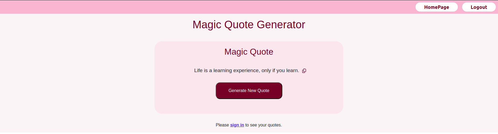

# Quote App

## Overview

The Quote App is a web application that allows users to generate random quotes, add their own quotes, and manage their list of personal quotes. Users can sign up, log in, and access a personalized experience where they can save and view their favorite quotes.

## Features

- **Random Quote Generator**: Displays a randomly generated quote each time a button is clicked.
- **User Authentication**: Allows users to sign up and log in.
- **User Quotes Management**: Users can add their own quotes, view them, and search through them.
- **Responsive Design**: The app is designed to be responsive and user-friendly.

## Technologies Used

- **Frontend**: React, React Router, React Bootstrap, React Icons, React Toastify
- **State Management**: React Hooks (`useState`, `useEffect`, `useCallback`, `useMemo`), React Context
- **Styling**: CSS, Bootstrap
- **API**: Axios (for fetching random quotes)
- **Local Storage**: Used for storing user information and quotes

## Installation

1. **Clone the repository**:
   ```sh
   git clone https://github.com/ismail-sajid/Magic-Quote-Generator.git
   cd Magic-Quote-Generator
   ```

## Instal dependencies

> npm install

## Start the development server

> npm start

## Project Structure

quote-app/
├── public/
├── src/
│ ├── components/
│ │ ├── Auth.tsx
│ │ ├── Login.tsx
│ │ ├── Navbar.tsx
│ │ ├── Quotes.tsx
│ │ ├── UserQuotes.tsx
│ ├── styles/
│ │ ├── App.css
│ │ ├── Login.css
│ │ ├── Navbar.css
│ │ ├── Quotes.css
│ │ ├── UserQuotes.css
│ ├── App.tsx
│ ├── index.tsx
│ ├── QuoteApp.tsx
│ ├── UserContext.tsx
├── package.json
└── README.md

## Screenshots

### Home Page


